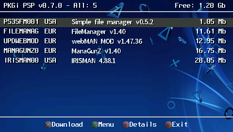

# PKGi PSP

[![Downloads][img_downloads]][pkgi_downloads] [![Release][img_latest]][pkgi_latest] [![License][img_license]][pkgi_license]
[](https://github.com/bucanero/pkgi-psp/actions/workflows/build.yml)
[](https://twitter.com/dparrino)

**PKGi PSP** is a PlayStation Portable port of [pkgi-ps3](https://github.com/bucanero/pkgi-ps3).

This homebrew app allows to download and install `.pkg` files directly on your PSP.



**Comments, ideas, suggestions?** You can [contact me](https://github.com/bucanero/) on [Twitter](https://twitter.com/dparrino) and on [my website](http://www.bucanero.com.ar/).

# Features

* **easy to use:** list available downloads, including searching, filtering, and sorting.
* **standalone:** no PC required, everything happens directly on the PSP.
* **automatic downloads:** just choose an item, and it will be downloaded by the app to your Memory Stick (`ms0:/PKG/`).
* **resumes interrupted downloads:** you can stop a download at any time, switch applications, and come back to resume the download later.
* **localization support:** Finnish, French, German, Indonesian, Italian, Polish, Portuguese, Spanish, Turkish

### Notes:
* **content activation:** downloaded content requires a valid license to run. If your PSP hasn't been activated, you can use one of the following plugins:
  - [npdrm_free_mod plugin](https://github.com/lusid1/npdrm_free_mod) (PSP/PS1 games only)
  - [npdrm_free plugin](https://github.com/qwikrazor87/npdrm_free) (PSP/PS1 games and DLCs)
  - [nploader_mod](https://github.com/lusid1/nploader_mod) (PSP DLCs only)

# Download

Get the [latest version here][pkgi_latest].

### Changelog

See the [latest changes here](CHANGELOG.md).

# Setup instructions

You need to create a [`pkgi.txt`](#sample-db-file) file in `ms0:/PSP/GAME/PKGI/` that contains the items available for installation.
The text database format is user customizable. Check [this section](#user-defined-db-format) to learn how to define your own custom DB format.

## Multiple databases

You can also load additional database files:

- `pkgi_games.txt`
- `pkgi_dlcs.txt`
- `pkgi_themes.txt`
- `pkgi_psx.txt`
- `pkgi_demos.txt`
- `pkgi_updates.txt`
- `pkgi_emulators.txt`
- `pkgi_apps.txt`
- `pkgi_tools.txt`

Items on each of these files will be auto-categorized to the file content type. **Note:** The app assumes that every database file has the same format, as defined in `dbformat.txt`.

## Online DB update

You can refresh and sync an online database by adding the DB URL(s) to the `config.txt` file in `ms0:/PSP/GAME/PKGI/`. 

For example:

```
url http://www.mysite.com/mylist.csv
url_demos http://www.demos.com/otherlist.csv
url_emulators http://www.example.com/emulators.csv
```

Using this setup, `pkgi.txt` will be updated with `mylist.csv`, `pgi_demos.txt` with `otherlist.csv` , and `pkgi_emulators.txt` with `emulators.csv`.

Next time you open the app, you'll have an additional menu option  called **Refresh**. When you select it, the local databases will be syncronized with the defined URLs.

# DB formats

The application needs a text database that contains the items available for installation, and it must follow the [default format definition](#default-db-format), or have a [custom format definition](#user-defined-db-format) file.

## Default DB format

The default database file format uses a very simple CSV format where each line means one item in the list:

```
contentid,type,name,description,rap,url,size,checksum
```

where:

| Column | Description |
|--------|-------------|
| `contentid` | is the full content id of the item, for example: `UP0000-NPXX99999_00-0000112223333000`.
| `type` | is a number for the item's content type. See the [table below](#content-types) for details. (set it to 0 if unknown)
| `name` | is a string for the item's name.
| `description` | is a string for the item's description.
| `rap` | the 16 hex bytes for a RAP file, if needed by the item (`.rap` files will be created on `/dev_hdd0/exdata`). Leave empty to skip the `.rap` file.
| `url` | is the HTTP/HTTPS/FTP/FTPS URL where to download the `.pkg` file.
| `size` | is the size in bytes of the `.pkg` file, or 0 if unknown.
| `checksum` | is a SHA256 digest of the `.pkg` file (as 32 hex bytes) to make sure the file is not tampered with. Leave empty to skip the check.

**Note:** `name` and `description` cannot contain newlines or commas.

### Sample DB file

An example `pkgi.txt` file following the `contentid,type,name,description,rap,url,size,checksum` format:

```
EP0001-FILEMANAG_00-0000000000000000,8,FileManager v1.40,File Manager,,http://github.com/Zarh/ManaGunZ/releases/download/1.40/FileManager_v1.40.pkg,12171120,FAF680636B18AD0B70AA61F48A78C5E42D6972F795F1B82CC434BE3DDE60F00F
UP0001-IRISMAN00_00-VER4880000000000,8,IRISMAN 4.88.1,Backup Manager,,http://github.com/aldostools/IRISMAN/releases/download/4.88/IRISMAN_4.88.pkg,29411984,E6EF607F0002B31BFB148BE4FC9BDBACB4E53110751F0E667C701D40B5290570
EP0001-MANAGUNZ0_00-0000000000000000,8,ManaGunZ v1.40,Backup Manager,,http://github.com/Zarh/ManaGunZ/releases/download/1.40/ManaGunZ_v1.40.pkg,17563040,CE0E4036903E881C08259FD69E777F6BC9CD24E823B471A7B15C88FDDBB2E330
UP0001-PS3SFM001_00-0000000000000000,8,Simple file manager v0.5.2,File Manager,,http://github.com/lmirel/fm_psx/releases/download/v0.5.2/sfm_ps3.pkg,1098800,301F64CC94E9BC442FDAC9199BFB8153AC2430A5E47331C6CF8A25B7881648A6
EP0001-UPDWEBMOD_00-0000000000000000,9,webMAN MOD v1.47.36,Backup Manager,,http://github.com/aldostools/webMAN-MOD/releases/download/1.47.36/webMAN_MOD_1.47.36_Installer.pkg,13580448,
```
### Content types

| Type value |	Content type | DB File |
|------------|--------------|---------|
| 0	| Unknown            |
| 1	| Game               | `pkgi_games.txt`
| 2	| DLC                | `pkgi_dlcs.txt`
| 3	| Theme              | `pkgi_themes.txt`
| 4	| PSX                | `pkgi_psx.txt`
| 5	| Demo               | `pkgi_demos.txt`
| 6	| Update             | `pkgi_updates.txt`
| 7	| Emulator           | `pkgi_emulators.txt`
| 8	| Application        | `pkgi_apps.txt`
| 9	| Tool               | `pkgi_tools.txt`

## User-defined DB format

To use a custom database format, you need to create a `dbformat.txt` file, and save it on `ms0:/PSP/GAME/PKGI/`.

The `dbformat.txt` definition file is a 2-line text file:
* Line 1: the custom delimiter character (e.g.: `;`, `,`, `|`, etc.)
* Line 2: the column names for every column in the custom database, delimited by the proper delimiter defined in line 1

**Note:** For the columns to be properly recognized, use the column tag names defined in the table above.

All the columns are optional. Your database might have more (or less) columns, so any unrecognized column will be skipped.

### Example

Example `dbformat.txt`, for a database using semi-colon (`;`) as separator:

```
;
name;TITLE ID;REGION;description;AUTHOR;TYPE;url;rap;size
```

**Result:** only the `name,description,url,rap,size` fields will be used.

### Example

Example `dbformat.txt`, for a database using character pipe (`|`) as separator:

```
|
REGION|TITLE|name|url|rap|contentid|DATE|PKG FILENAME|size|checksum
```

**Result:** only the `name,url,rap,contentid,size,checksum` fields will be used.

# Usage

Using the application is simple and straight-forward: 

 - Move <kbd>UP</kbd>/<kbd>DOWN</kbd> to select the item you want to download, and press .
 - To see the item's details, press .
 - To sort/filter/search press .
It will open the context menu. Press  again to confirm the new settings, or press  to cancel any changes.
- Press left or right trigger buttons <kbd>L1</kbd>/<kbd>R1</kbd> to move pages up or down.
- Press <kbd>LEFT</kbd>/<kbd>RIGHT</kbd> buttons to switch between categories.

### Notes

- **RAP data:** if the item has `.rap` data, the file will be saved in the `ms0:/PKG/RAP/` folder.


# Q&A

1. Where to get a `rap` string? 
   
   You can use a tool like RIF2RAP to generate a `.rap` from your existing `.rif` files. Then you can use a tool like `hexdump` to get the hex byte string.

2. Where to get `.pkg` links?
   
   You can use [PSDLE][] to find `.pkg` URLs for the games you own. Then either use the original URL, or host the file on your own web server.

3. Where to remove interrupted/failed downloads to free up disk space?
   
   Check the `ms0:/PKG/` folder - each download will be in a separate `.pkg` file by its content ID. Simply delete the file and start again.

4. Download speed is too slow!
   
   Optimization is still pending. (Optional) Set `Power Save Settings` -> `WLAN Power save` -> `OFF` , if you want to speed up the download process.

# Credits

* [Bucanero](http://www.bucanero.com.ar/): Project developer

## Acknowledgements

* [mmozeiko](https://github.com/mmozeiko/): [pkgi](https://github.com/mmozeiko/pkgi) (PS Vita), [pkg2zip](https://github.com/mmozeiko/pkg2zip)
* [qwikrazor87](https://github.com/qwikrazor87/): [Depackager](https://github.com/bucanero/psptools/tree/master/depackager)

# Building

You need to have installed:

- [PSP SDK](https://github.com/pspdev/)
- [mbedTLS](https://github.com/pspdev/psp-packages/tree/master/mbedtls) library
- [cURL](https://github.com/pspdev/psp-packages/tree/master/curl) library
- [Mini18n](https://github.com/bucanero/mini18n) library
- [dbglogger](https://github.com/bucanero/dbglogger) library (only required for debug logging)

Run `cmake . && make` to create a release build. If you want to create a `.zip` file, run `make createzip`.

## Debugging

To enable debug logging, pass `-DPKGI_ENABLE_DEBUG=ON` argument to cmake. The application will send debug messages to
UDP multicast address `239.255.0.100:30000`. To receive them you can use [socat][] on your computer:

    $ socat udp4-recv:30000,ip-add-membership=239.255.0.100:0.0.0.0 -

You can also set the `PSPIP` environment variable to your PSP's IP address, and use `make send` to upload `EBOOT.PBP` directly to the `ms0:/PSP/GAME/PKGI` folder.

# License

`pkgi-psp` is released under the [MIT License](LICENSE).

[PSDLE]: https://repod.github.io/psdle/
[socat]: http://www.dest-unreach.org/socat/
[pkgi_downloads]: https://github.com/bucanero/pkgi-psp/releases
[pkgi_latest]: https://github.com/bucanero/pkgi-psp/releases/latest
[pkgi_license]: https://github.com/bucanero/pkgi-psp/blob/main/LICENSE
[img_downloads]: https://img.shields.io/github/downloads/bucanero/pkgi-psp/total.svg?maxAge=3600
[img_latest]: https://img.shields.io/github/release/bucanero/pkgi-psp.svg?maxAge=3600
[img_license]: https://img.shields.io/github/license/bucanero/pkgi-psp.svg?maxAge=2592000
